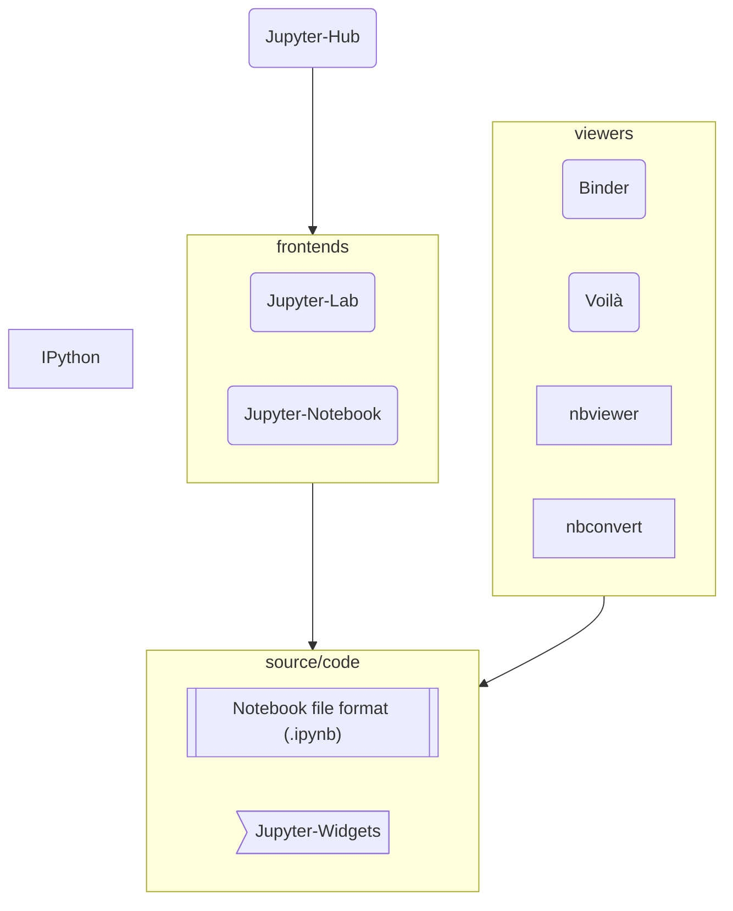

# What is Jupyter

[Get Involved]: https://jupyter.org/community
[History of Jupyter]: ./history_of_jupyter.md
[jupyter.org/about]: https://jupyter.org/about
[Jupyter-Lab]: https://jupyterlab.readthedocs.io
[Project Jupyter Governance]: https://jupyter.org/governance/intro.html
[Python]: https://en.wikipedia.org/wiki/Python_(programming_language)
[subprojects]: https://jupyter.org/governance/list_of_subprojects.html

> If you are *absolutely new* to "Jupyter" and this is the first page you read on
the topic here goes the shortest description of the whole Jupyter thing:
many years ago a group of people defined a document format where we can write 
not only good-old text (eg, in English) but also code (eg, in [Python][]) in
such a way that it can be run, rendering the document *dynamic* regarding its
content. Such document is popularly called *executable notebook*, or simply
"notebook". From there and around the *notebook* file format a whole ecosystem 
of software tools was created, and the Project Jupyter is there to nurture its
development.

The term "Jupyter" can mean different things depending on the context it is being used: Jupyter, the notebook; Jupyter, the server; Jupyter, the project.
It is not unusual to fill confused with the many uses of "Jupyter", especially 
for new comers, so let's try to clear the fog around it.

Here is a situation that happened to me and my colleague (10+ years in the business)
on of these days:

> \- Did you prepare the Jupyter *notebook*?
>
> \- Which *notebook*? The one with those plots?
>
> \- No. The *server* to deploy.
>
> \- Oh! You mean the *Lab*?!
>
> \- Yes, but set as *Notebook*, not *Lab*.
>
> \- Yes, right. Will do.
>
> \- Also, can you send me that *notebook*, with the plots?

...This is a conversation many of the old-users are used to but an outsider would 
judge it insane, and I don't blame them. 

There are historical and social reasons for why some terms are overloaded or 
overlapping; Jupyter grew extremely successful, out in the open, by the community.
If you want to learn its origins and timeline development, have a look at
the [History of Jupyter][].

In this document, we are going to define terms and relate major components of the 
Jupyter ecosystem. This is *not* a complete reference of every aspect of Jupyter,
but rather a clarification document where the overlapping, or ambiguous concepts.

If you are completely new to *Jupyter*, the [`jupyter.org/about`][jupyter.org/about]
page is a good first reading offering an overview of Jupyter, the **project**.
For the purpose of this document, let's distinguish between (1) the *institution* 
and (2) the *software*:

1. *Jupyter* is a non-profit organization dedicated to the development of a series of 
free and open source software (FOSS) composing the *Jupyter ecosystem*.

2. The software ecosystem is composed by applications such as [Jupyter-Lab][],
file format standards, and many other tools and libraries. Many of them, for
historical reasons, have "Jupyter" in their names (Jupyter-Notebook, Jupyter-Hub).

The whole of the Jupyter ecosystem is commonly referred as the Jupyter *project*.
Jupyter -- the project -- is structured in *sub-projects*, the sub-projects 
are responsible for the development of specific software component. Such 
structure is transparent and irrelevant to most users but will be relevant for
those willing to collaborating to the project.

> For detailed information on the organizational structure of the Project, 
> we invite you to read [Project Jupyter Governance][] pages.
> And if you would like to contribute or just get closer to the software development
> process, have a look at the [Get Involved][] page.

The graph below presents the best known software components of the Project.
There are many other components -- like Jupyter-Server, Jupyter-Kernels --
that we will talk about later, but for starter we go with the most common ones.

Connections and groups in this diagram are not formal relationships but
simple indicators to help us draw the big picture in the next sections.

## *Notebook* vs *notebook*
[nbformat.readthedocs.io]: https://nbformat.readthedocs.io
[jupyter-notebook.readthedocs.io]: https://jupyter-notebook.readthedocs.io

Probably the most overloaded term within the community is "notebook".

Formally, "notebook" has two meanings: the **notebook file format** -- the `.ipynb` 
files -- where data/content are stored (ie, the digital document); 
And the **Jupyter-Notebook** application for editing and running notebook files.

Jupyter-Notebook -- the application -- may be referred simply as "Notebook".
As in many situations in life, discerning between the (notebook) file/document
and the (Notebook) application should be clear from the context.

In Jupyter official documentation we refer to the application as Jupyter-Notebook 
or simply Notebook with capital "N". 
The digital file/document is written as a common name (ie, lower-case) notebook.

You can find detailed information about notebook file format, `nbformat`, and
the frontend application in their respective official documentation:

- Notebook file format: [nbformat.readthedocs.io][]
- Jupyter-Notebook: [jupyter-notebook.readthedocs.io][]

## *Notebook* and *Lab*
[jupyterlab.readthedocs.io]: https://jupyterlab.readthedocs.io

There are two applications (aka, frontends) to edit and run notebooks:
Jupyter-Notebook and Jupyter-Lab. Jupyter-Lab is an evolution of Jupyter-Notebook, 
it provides a more concise and customizable user interface.

It is mostly a matter of preference which application/interface to use, 
they both provide pretty much the same functionalities on what regards editing 
and running notebook documents.
The *Lab* provides a richer graphical user interface (GUI), whereas *Notebook*
provides a simpler GUI.

Personally, I like to use Jupyter-Lab on my daily work as a data analyst, and 
Jupyter-Notebook while teaching so we can all focus on the notebook's content.

Regarding ambiguous use of terms, sometimes people will refer to Jupyter-Lab 
as "Notebook"; This is certainly the case among old practitioners, that used
the Notebook application extensively in a time prior to Jupyter-Lab.

- Jupyter-Lab: [jupyterlab.readthedocs.io][]

## What about *Hub*?
[jupyterhub.readthedocs.io]: https://jupyterhub.readthedocs.io

Jupyter-Hub is a manager of Jupyter-Lab and Jupyter-Notebook instances in
multi-user settings. 

In a Jupyter-Hub setup editing and running notebook files is
still performed by Lab and Notebook, the Hub is responsible for authenticating
users and handling them their corresponding Lab/Notebook instance connection.

Jupyter-Hub can be set up in different system configurations: in a single computer,
in a cluster of computers, in containers in the cloud.
The Hub is quite flexible and easy to extend for specific multi-user scenarios.

For details:

- Jupyter-Hub: [jupyterhub.readthedocs.io][]

## IPython, Jupyter-Widgets and ...IPyWidgets?!
[ipywidgets.readthedocs.io]: https://ipywidgets.readthedocs.io
[ipython.readthedocs.io/interactive/tutorial]: https://ipython.readthedocs.io/en/stable/interactive/tutorial.html
[ipython.readthedocs.io/interactive/magics]: https://ipython.readthedocs.io/en/stable/interactive/magics.html
[ipykernel.readthedocs.io]: https://ipykernel.readthedocs.io
[ipython.org]: https://ipython.org

Once upon a time, there was only IPython, and among many other things
(see the [History of Jupyter][]) `ipywidgets` as the library providing 
interactive widgets (buttons, sliders, etc) to be used in Jupyter notebooks.

It took some time for IPyWidgets to be renamed after "Jupyter", but it eventually
happened (or *is happening*).
To not break compatibility with older code-bases, the  software library is
still called `ipywidgets`.
The subproject and high-level references to the widgets were renamed to
Jupyter-Widgets.
By all means, **Jupyter-Widgets** and IPyWidgets are the very same thing.

- Jupyter-Widgets: [ipywidgets.readthedocs.io][]

Going back to **IPython**... Depending on the use made of Jupyter and Python,
many users don't happen to interact with IPython directly.
If not essential, the functionalities provided by IPython are much helpful:

- interactive shell: [ipython.readthedocs.io/interactive/tutorial][]
- magic commands: [ipython.readthedocs.io/interactive/magics][]
- Python kernels: [ipykernel.readthedocs.io][]

The `ipython` package provides many other features worth having a look:

- IPython: [ipython.org][]