# What is Jupyter

[Get Involved]: https://jupyter.org/community
[History of Jupyter]: ./history_of_jupyter.md
[jupyter.org/about]: https://jupyter.org/about
[Jupyter-Lab]: https://jupyterlab.readthedocs.io
[Project Jupyter Governance]: https://jupyter.org/governance/intro.html
[Python]: https://en.wikipedia.org/wiki/Python_(programming_language)
[subprojects]: https://jupyter.org/governance/list_of_subprojects.html

> If you are *absolutely new* to "Jupyter" and this is the first page you read on
the topic here goes the shortest description of the whole Jupyter thing:
many years ago a group of people defined a document format where we can write 
not only good-old text (eg, in English) but also code (eg, in [Python][]) in
such a way that it can be run, rendering the document *dynamic* regarding its
content. Such document is popularly called *executable notebook*, or simply
"notebook". From there and around the *notebook* file format a whole ecosystem 
of software tools was created, and the Project Jupyter is there to nurture its
development.

The term "Jupyter" can mean different things depending on the context it is being used: Jupyter, the notebook; Jupyter, the server; Jupyter, the project.
It is not unusual to fill confused with the many uses of "Jupyter", especially 
for new comers, so let's try to clear the fog around it.

Here is a situation that happened to me and my colleague (10+ years in the business)
on of these days:

> \- Did you prepare the Jupyter *notebook*?
>
> \- Which *notebook*? The one with those plots?
>
> \- No. The *server* to deploy.
>
> \- Oh! You mean the *Lab*?!
>
> \- Yes, but set as *Notebook*, not *Lab*.
>
> \- Yes, right. Will do.
>
> \- Also, can you send me that *notebook*, with the plots?

...This is a conversation many of the old-users are used to but an outsider would 
judge it insane, and I don't blame them. 

There are historical and social reasons for why some terms are overloaded or 
overlapping; Jupyter grew extremely successful, out in the open, by the community.
If you want to learn its origins and timeline development, have a look at
the [History of Jupyter][].

In this document, we are going to define terms and relate major components of the 
Jupyter ecosystem. This is *not* a complete reference of every aspect of Jupyter,
but rather a clarification document where the overlapping, or ambiguous concepts.

If you are completely new to *Jupyter*, the [`jupyter.org/about`][jupyter.org/about]
page is a good first reading offering an overview of Jupyter, the **project**.
For the purpose of this document, let's distinguish between (1) the *institution* 
and (2) the *software*:

1. *Jupyter* is a non-profit organization dedicated to the development of a series of 
free and open source software (FOSS) composing the *Jupyter ecosystem*.

2. The software ecosystem is composed by applications such as [Jupyter-Lab][],
file format standards, and many other tools and libraries. Many of them, for
historical reasons, have "Jupyter" in their names (Jupyter-Notebook, Jupyter-Hub).

The whole of the Jupyter ecosystem is commonly referred as the Jupyter *project*.
Jupyter -- the project -- is structured in *sub-projects*, the sub-projects 
are responsible for the development of specific software component. Such 
structure is transparent and irrelevant to most users but will be relevant for
those willing to collaborating to the project.

> For detailed information on the organizational structure of the Project, 
> we invite you to read [Project Jupyter Governance][] pages.
> And if you would like to contribute or just get closer to the software development
> process, have a look at the [Get Involved][] page.

The graph below presents the best known software components of the Project.
There are many other components -- like Jupyter-Server, Jupyter-Kernels --
that we will talk about later, but for starter we go with the most common ones.

```mermaid
graph TD
    IPython

    subgraph Source-code
        Nbformat[["Notebook File Format (.ipynb)"]]
        JupyterWidgets>Jupyter Widgets]
    end

    %%subgraph Interpreters
        subgraph Frontends
            JupyterNotebook(Jupyter Notebook)
            JupyterLab(Jupyter Lab)
        end

        subgraph nb-Tools
            Nbviewer[nbviewer]
            Nbconvert[nbconvert]
            Nbdime[nbdime]
        end

        Voila(Voilà)
    %%end

    %%subgraph Hubs
        JupyterHub(Jupyter Hub)
        BinderHub(BinderHub)
        BinderHub --> JupyterHub    
    %%end

    JupyterHub --> Frontends
    IPython ~~~ Source-code
    Frontends ---> Source-code
    Voila ---> Source-code
    nb-Tools --> Source-code

```

## *Notebook* vs *notebook*

Probably the most overloaded term within the community is "notebook".

Formally, "notebook" has two meanings: the notebook *file* format -- the `.ipynb` 
files -- where data/content are stored (ie, the digital document); 
And the Notebook *application* for editing and running the notebook files.

We will refer to the application as Jupyter-Notebook or simply Notebook 
with capital "N". 
Whereas the digital file will be referred as (lower-case) **notebook**, if 
necessary to talk technical about the internal *format* definition of notebooks
we will refer to it as "nbformat".

> By the way, if want to learn the technical aspect of notebook files format,
nbformat, see the specific documentation at https://nbformat.readthedocs.io.

There is also another situation where the term "notebook" can be overused:
when we are referring to *any* (editing) application, Jupyter-Lab for instance.

## *Notebook* and *Lab*

There are two graphical user interface (applications) to edit and run notebooks:
Jupyter-Notebook and Jupyter-Lab. Jupyter-Lab is an evolution of Jupyter-Notebook, 
it provides a more concise and customizable user interface.

At of this writing it is mostly a matter of preference which application/interface
to use, they provide the same functionalities on what regards editing and running
notebook documents.

Regarding ambiguous use of terms, sometimes people will refer to Jupyter-Lab 
as "Notebook"; 
This will be the case when you talk to someone that is old enough to have used
the Notebook application extensively, in a time when Jupyter-Lab was not here.

-----
### TBC
-----